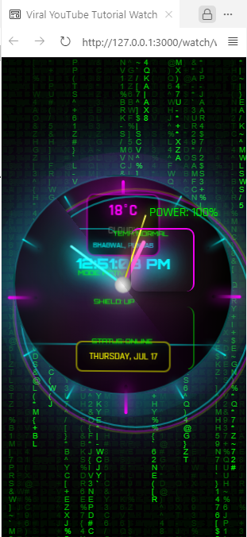

⚡ Cyberpunk Animated Clock Analog Portfolio

A futuristic portfolio website featuring a stunning holographic analog clock, matrix background, real-time GSAP animations, and weather HUD, all crafted using HTML, CSS, JavaScript, and Three.js.

🌐 Live Demo
🔗 Watch it Live (Add your GitHub Pages/Netlify link here)

🚀 Project Highlights
⏱️ 3D Animated Analog Clock with glowing neon hands

🌌 Matrix-style background effect using HTML5 Canvas

💡 GSAP-powered animations (clock hands, hover, glitch, HUD)

📺 Cyberpunk UI with glitch scans and energy rings

📱 Fully responsive and mobile-friendly

☀️ Dynamic weather info display

🔐 Minimal dependencies and fast load time

⚙️ Future-ready: Three.js included for extendable 3D elements

🔧 Tech Stack
Purpose	Technology / Library
Structure	HTML5
Styling	CSS3 (Flexbox, Grid, Clamp Units, Gradients)
Logic & Effects	Vanilla JavaScript
Animation	GSAP (GreenSock Animation Platform)
3D Support	Three.js (CDN Included)
Font Styling	Google Fonts – Orbitron & Rajdhani
UX/UI Design	Custom HUD, Glitch FX, and Responsive Layout

🖼️ Screenshots
Home View	Weather HUD + Neon Clock
	

📂 Project Structure
bash
Copy
Edit
portfolio/
├── index.html           # 
├── screenshot.png       # Preview image
├── README.md            # This file
├── LICENSE              # MIT License
📦 Features in Detail
🧠 Interactive Elements
Neon analog clock with GSAP-powered rotation

Weather HUD: animated temperature, conditions & location

Dynamic glitch effect and scanner line

🌐 Background & Motion
Matrix-style canvas animation

3 energy rings pulsing around the clock

Animated HUD corners and glowing elements

📱 Responsive Design
Fully optimized for mobile devices

Adaptive clamp() units for fluid resizing

Touch interactions for mobile users

🔍 SEO Keywords
Use these to boost discoverability:

css
Copy
Edit
cyberpunk analog clock, animated neon watch UI, GSAP clock animation,
html css javascript 3D clock, futuristic web UI, matrix canvas background,
cyber UI animation, responsive animated clock website, portfolio hologram,
cyberpunk HUD dashboard, GSAP 3D animation portfolio
✅ How to Run
Clone this repo:

bash
Copy
Edit
git clone https://github.com/your-username/cyberpunk-clock-portfolio.git
cd cyberpunk-clock-portfolio
Open index.html in your browser

Enjoy the experience ⚡

💡 Future Improvements
Weather API integration for live updates

Sound effects on hover & time tick

Real-time clock sync from system time

Night/day theme switcher

Customizable clock face designs

📃 License
MIT License — feel free to use and modify for your personal or commercial projects.

🙌 Like This Project?
Give it a ⭐ on GitHub and share your own version!